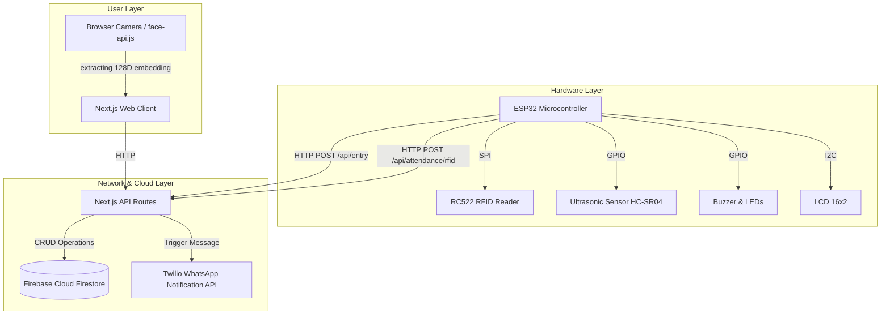
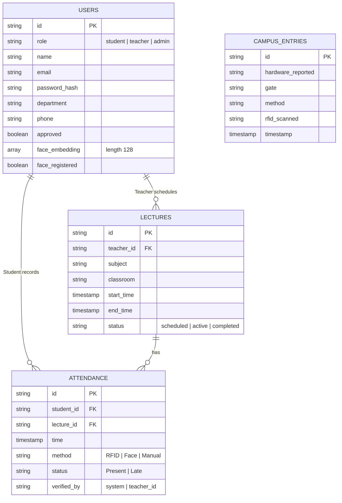

# PSR Campus System Architecture

## 1. System Architecture Diagram
This diagram outlines the flow between the different layers of the PSR Campus System.

## 2. Entity Relationship (ER) Diagram
This diagram shows the main data structures stored in the NoSQL Firebase store.

## 3. Circuit and Wiring Table
Included in `/esp32_firmware/smart_campus.ino` header comment.
- **RFID**: SPI (SDA=5, SCK=18, MOSI=23, MISO=19, RST=22)
- **Ultrasonic**: TRIG=12, ECHO=14
- **Buzzer**: 27
- **LCD**: I2C (SDA=21, SCL=22)
